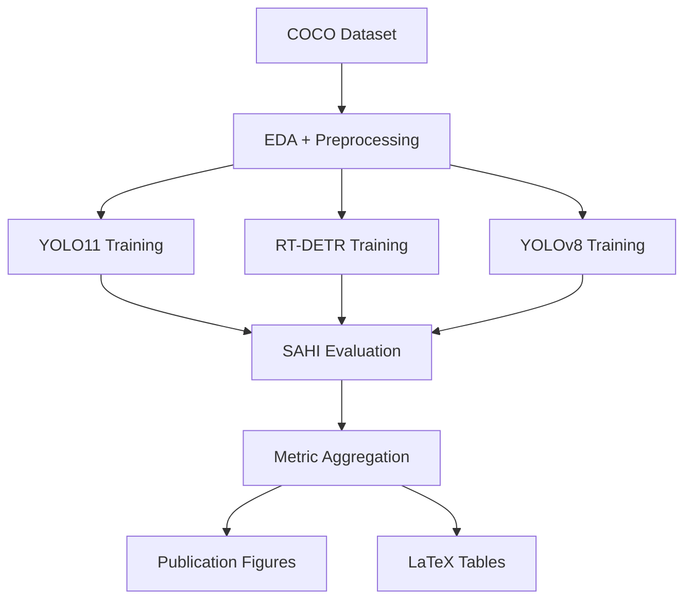

# 🛰️ Satellite Aerial Object Detection: 5-Model Benchmark + SAHI Ablation
SAHI-Augmented Multi-Architecture Satellite Image Object Detection

<div align="center">


**A comprehensive benchmarking framework for satellite aerial object detection using YOLO11, YOLOv8, and RT-DETR with SAHI-based small object enhancement.**

</div>

---

# 📌 Overview

This repository presents an **end-to-end deep learning pipeline** for evaluating five modern object detection architectures on satellite imagery datasets formatted in **COCO annotation style**.

The framework focuses on detecting:

* ✈️ `plane`
* 🚢 `ship`
* 🚗 `vehicle`

The project was designed for:

* Academic benchmarking
* Small-object detection research
* SAHI ablation analysis
* Reproducible experimentation
* Publication-ready visualization generation

It provides a **locked-hyperparameter comparison** across all architectures to ensure fair and scientifically valid evaluation.

---

# 🎯 Key Features

## ✅ Multi-Architecture Benchmarking

Compare 5 state-of-the-art detectors:

| Model     | Type                       |
| --------- | -------------------------- |
| YOLO11n   | Lightweight CNN            |
| YOLO11s   | Small CNN                  |
| YOLO11m   | Medium CNN                 |
| YOLOv8m   | Anchor-free CNN            |
| RT-DETR-L | Transformer-based Detector |

---

## ✅ SAHI Ablation Study

Implements **Slicing Aided Hyper Inference (SAHI)** for improved small-object detection.

Evaluated slice sizes:

* 480 px
* 320 px
* 160 px

Each model is evaluated using:

* Standard inference
* SAHI-enhanced inference

---

## ✅ Fully Automated Research Pipeline

The framework automatically generates:

* High-resolution figures
* Comparative performance plots
* Radar charts
* Precision-recall curves
* SAHI gain analysis
* Publication-ready LaTeX tables

---

## ✅ Modular Notebook Architecture

All notebooks are self-contained and independently executable.

Optimized for:

* Kaggle T4 x2
* Google Colab
* Local CUDA systems

---

# 🏗️ Project Structure

```bash
├── nb1-yolo11-train.ipynb
├── nb2-rtdetr-yolov8-train-ipynb.ipynb
├── nb3-evaluation-comparison-ipynb.ipynb
│
├── outputs/
│   ├── figures/
│   ├── weights/
│   ├── csv/
│   └── latex/
│
├── dataset/
│   ├── train/
│   ├── val/
│   ├── test/
│   └── annotations/
│
├── requirements.txt
└── README.md
```

---

# ⚙️ Pipeline Architecture

# 1️⃣ Notebook 1 — YOLO11 Baselines & EDA

## `nb1-yolo11-train.ipynb`

### Features

### 📊 Exploratory Data Analysis (EDA)

Performs comprehensive dataset analysis:

* Class distribution
* Bounding box density
* Spatial heatmaps
* Object size distribution
* Aspect ratio analysis
* Scale imbalance visualization

---

### 🛠️ Data Engineering

* Converts COCO annotations to YOLO format
* Validates annotations
* Repairs out-of-bound coordinates
* Cleans corrupted labels automatically

---

### 🚀 Baseline Training

Trains:

* YOLO11n
* YOLO11s
* YOLO11m

using a strict shared hyperparameter configuration.

---

### 🔬 SAHI Ablation

Evaluates:

| Slice Size | Purpose                    |
| ---------- | -------------------------- |
| 480 px     | Large context              |
| 320 px     | Balanced                   |
| 160 px     | Extreme small-object focus |

Exports:

```bash
nb1_results.csv
```

along with trained `.pt` weights.

---

# 2️⃣ Notebook 2 — RT-DETR & YOLOv8

## `nb2-rtdetr-yolov8-train-ipynb.ipynb`

### Features

### 🤖 Advanced Detection Architectures

Trains:

* RT-DETR-L
* YOLOv8m

---

### 🔁 Independent Execution

Contains full preprocessing pipeline internally.

Can run independently from Notebook 1.

---

### ⚖️ Controlled Experimental Setup

Uses the exact same:

* training epochs
* optimizer settings
* augmentation pipeline
* SAHI configurations
* image sizes
* batch sizes

ensuring a fair one-to-one comparison.

Exports:

```bash
nb2_results.csv
```

and corresponding model weights.

---

# 3️⃣ Notebook 3 — Evaluation & Publication Generator

## `nb3-evaluation-comparison-ipynb.ipynb`

### Features

### 📈 Unified Benchmarking

Aggregates all:

* model weights
* metric CSVs
* evaluation logs

from previous notebooks.

---

### 📊 20-Metric Comparison Matrix

Evaluates:

* mAP@50
* mAP@50:95
* Precision
* Recall
* F1-score
* FPS
* Parameter efficiency
* SAHI gain
* Inference latency
* Small-object recall
* Memory usage
* FLOPs
* and more

---

### 📝 Automatic Publication Export

Generates:

* 300 DPI figures
* radar charts
* PR curves
* scatter plots
* SAHI gain plots
* confusion matrices
* LaTeX-ready tables

Exports:

```bash
table_main_results.tex
```

for direct insertion into research manuscripts.

---

# 🚀 Installation

## Clone Repository

```bash
git clone https://github.com/yourusername/satellite-aerial-object-detection.git

cd satellite-aerial-object-detection
```

---

## Create Environment

```bash
conda create -n satdet python=3.10

conda activate satdet
```

---

## Install Dependencies

```bash
pip install -r requirements.txt
```

---

# 📦 Requirements

```txt
ultralytics
sahi
torch
torchvision
opencv-python
pandas
numpy
matplotlib
seaborn
scikit-learn
pycocotools
tqdm
```

---

# 📁 Dataset Format

The dataset must follow **COCO annotation format**.

Example:

```bash
dataset/
├── train/
├── val/
├── test/
└── annotations/
    ├── instances_train.json
    ├── instances_val.json
    └── instances_test.json
```

---

# ▶️ Usage

# Step 1 — Run Notebook 1

```bash
nb1-yolo11-train.ipynb
```

Outputs:

* EDA figures
* YOLO11 weights
* SAHI metrics
* `nb1_results.csv`

---

# Step 2 — Run Notebook 2

```bash
nb2-rtdetr-yolov8-train-ipynb.ipynb
```

Outputs:

* RT-DETR weights
* YOLOv8 weights
* SAHI metrics
* `nb2_results.csv`

---

# Step 3 — Run Notebook 3

```bash
nb3-evaluation-comparison-ipynb.ipynb
```

Outputs:

* Publication figures
* LaTeX tables
* Master benchmark comparison

---

# 📊 Outputs

## Generated Automatically

### 📈 Dataset Analysis

* 11 EDA figures
* Heatmaps
* Scale distribution plots
* Density maps

---

### 🎯 Prediction Visualizations

* Standard inference outputs
* SAHI-enhanced outputs
* Train/Val/Test comparisons

---

### 📚 Publication Assets

* 12 publication-quality figures
* 300 DPI exports
* LaTeX tables
* PR curves
* Radar charts
* Efficiency scatter plots

---

# 🧪 Experimental Design

## Locked Hyperparameter Protocol

All architectures use:

* identical epochs
* same augmentation strategy
* same optimizer
* same image size
* same batch size
* same training schedule

to ensure scientific fairness.

---

# 🔬 Research Objectives

This work investigates:

* Effectiveness of SAHI on satellite imagery
* Transformer vs CNN detectors
* Small-object detection challenges
* Trade-offs between accuracy and efficiency
* Parameter efficiency across architectures

---

# 📌 Example Research Questions

* Does SAHI consistently improve small-object recall?
* Can RT-DETR outperform YOLO models on dense aerial scenes?
* Which architecture offers the best parameter-efficiency ratio?
* How does slice size impact inference accuracy?

---

# 🖥️ Hardware Recommendations

| Hardware | Recommended      |
| -------- | ---------------- |
| GPU      | NVIDIA T4 / A100 |
| VRAM     | 16GB+            |
| CUDA     | 11.8+            |
| RAM      | 16GB+            |

---

# 📷 Example Workflow



---

# 📚 Citation

If you use this repository in academic research, please cite:

```bibtex
@misc{satellite_detection_benchmark_2026,
  title={SAHI-Augmented Multi-Architecture Satellite Image Object Detection},
  author={Mohammad Rakibul Hasan Rifat},
  year={2026},
  url={https://github.com/yourusername/satellite-aerial-object-detection}
}
```

---

# 🤝 Contributing

Contributions are welcome.

Potential areas:

* Additional transformer architectures
* Quantization experiments
* TensorRT benchmarking
* Edge-device optimization
* Multi-spectral imagery support

---

# 📜 License

This project is licensed under the MIT License.

---

# ⭐ Acknowledgements

Built using:

* Ultralytics YOLO
* SAHI
* PyTorch
* COCO API

Special thanks to the open-source computer vision research community.

---

<div align="center">

## 🌍 Advancing Small Object Detection for Remote Sensing Research

</div>
